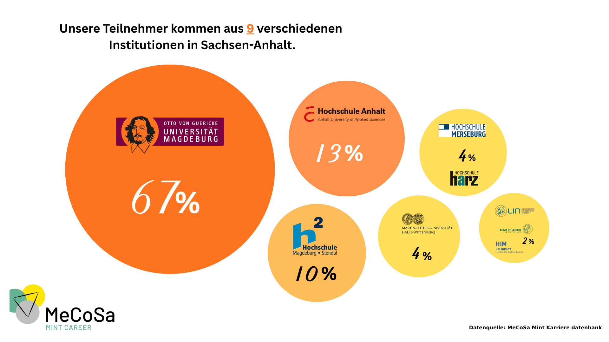
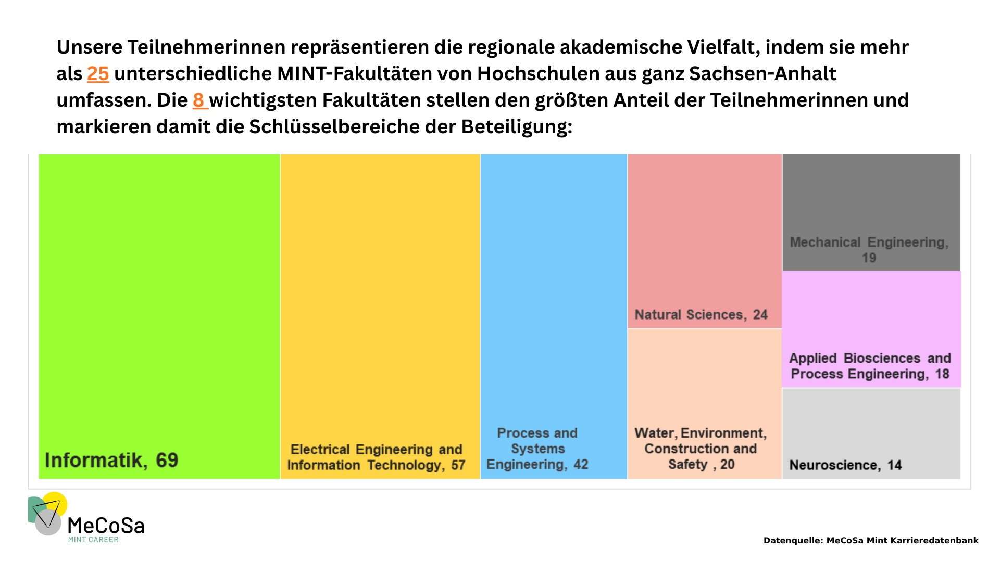

Passionate data enthusiast with a robust background in data and business analytics and a strong interest in using datadriven
insights to tackle real-world challenges.

# Let the visuals talk

## I love story-telling- sharing my latest data stories for an organization I work.

# Analysis and Visualization Projects

## 1. Financial Loan Analysis Dashboard
[Link to the project](https://github.com/kari-hue/PowerBI-projects/tree/main/Financial%20Loan%20Dashboard)

<b> About the project:</b> This is a visualization project accomplished using PowerBI, on a finance dataset taken from the American household to answer questions like:
 
1. What is the total number of loan applications along with the funded amount and paid amount with MTD contribution?
2. How does good and bad loan differs from each other in terms of number of application, funded amount and total paid amount?
3. How does total loan amount issued differs from one state to other in USA and also based on Home ownership?

### Task accomplished in this project
* Analyzed Good vs Bad loan issued, Loan Status, Loan Amount issued by states, Loan Amount issued by month, Loan Amount issued by Loan Ownership
* Used Time Intelligence DAX functions to calculate MTD, YTD, QTD values
* Created new calculated field and measures using IF(), SWITCH(), RANK() functions
* Advanced and clear visulizations(Bar graph, area map, geographical map, donout chart) are used with clean labels and tooltips
* Wide range of filters available in the project

### Results Screenshots  

#### Summary

#### Details

#### Overview

  
## 2. Sales Dashboard
[Link to the project](https://github.com/kari-hue/PowerBI-projects/tree/main/Car%20sales%20Dashboard)

<b> About the project: </b> This dashboard is a visualization project focusing on analyzing the car sales across different states in USA to answer following questions:
 
1. What is the YTD total and average car sales revenue and total number of car sold?
2. What is the weekly trend of the car sales pointing out the week with the highest car sales revenue and with the lowest car sales revenue?
3. How does car sales differs from state to state in USA?
4. Which company is contributing to the highest car sales in USA in terms of revenue and number?
5. How does sales differes from different body style and body colour?

### Task accomplished in this project
* Analysized the car sales trend by Region, company, body style, monthly basis.
* Used time intelligence functions to represent KPIs such as YTD , MTD value
* Navigable filters and visuals
* Use of calculated field and measures
  
### Results Screenshots
#### Sales Overview

#### Sales Details

## 3. Election portal visualization project 
<b>About the project :</b> “Election portal for local election in Nepal” is visualization project whose main aim is to leverage the data collected from the local election 2079 along with the data from the past local election in order to create an interactive dashboard.

### Task performed
* Data collection - Pdfs, web scraping using Beautiful Soup, Selenium, Webdriver
* Data Analysis - Vote Difference, Gender Wise Analysis, Age wise Analysis, Voteswing
* Data Visualization - Comparison chart, Tables, Sunbrust Chart all using python plotly

### Result Screenshot
#### Vote Representation
 

#### Genderwise Representation

#### Vote swing Representation
 

# Data Analyis and Machine Learning project

## 1. Customer Segmentation 
[Link to the project](https://github.com/kari-hue/MachineLearningModels/blob/main/Customer%20Segmentation/Customer%20Segmentation%20(1).ipynb)

<b> About the project:</b> This is a complete end to end machine learning project accomplished by analyzing a dataset that is based on transaction taken form a UK-based retailer. The dataset is present in [UCI Machine Learning Repository](https://archive.ics.uci.edu/dataset/352/online+retail). The primary objective of the project is to amplify the efficiency of marketing strategies and boost sales through <b>Customer Segmentation</b>. For this purpose,I used the concept of <b>K-Means Clustering</b> algorithm.

### Task accomplished in this project
* <b>Data cleaning & Tranformation</b> : Data cleaning has been done by handling missing values,duplicates, and outliers, preparing it for the effective clustering.
* <b> Feature Engineering </b>: New features has been created based on the transactional data to create a customer-centric dataset, setting the foundation for customer segmentation. For e.g. Calculating recency by using the current date and last purchased date of the customer, calculating seasonality and trends
* <b> Data preprocessing </b>: Undertook feature scaling and dimensionality reduction to streamline the data enhancing the efficiency of the clustering process.
* <b> Customer Segmentation using K-means Clustering</b>: The customers are segmented into distinct groups using K-means, facilitating targeted marketing and personalized strategies.
* <b> Cluster Analysis & Evaluation</b>: Analyze and profile of each cluster to develop targeted markting strategies and assess the quality of the clusters formed.
### Inference
We can infer and draw some conclusions about the clusters:

* Cluster 0: From the observation, we can see that the customer belongs to this cluster
-  Tend to do hourly shopping(active during some hrs of the time), frequent buyers 
-  They are low spenders but buy diverse products, and their purchase pattern is also frequent. -impulse buyers

<b> suggestion:</b> We can quote them as "Hourly buying customers" - Push low-value fast-moving products to lure these customers, increase flash sales or some hourly sale campaign, and target these customers

* Cluster 1: The customer belonging to this cluster
- Are the high spenders, infrequent buyers, who buy diverse products and also have a lot of cancellations
<b> suggestion:</b> We can address them as Infrequent high spending buyers - try to reduce cancellations, quality control of the products sold, and reminder notifications to make them come back sooner to the platform

* Cluster 3: The customers belonging to this cluster
- Are the low-spending customers the least active ones
<b> suggestion:</b> We can address them as almost churning customers - Throw reminder notifications on a daily basis, alluring discounts, pushing a variety low low-value products

#### Results Screenshots
##### Choosing the best cluster using Elbow Method

##### Distribution of three clusters

##### Profiling the customers

 

